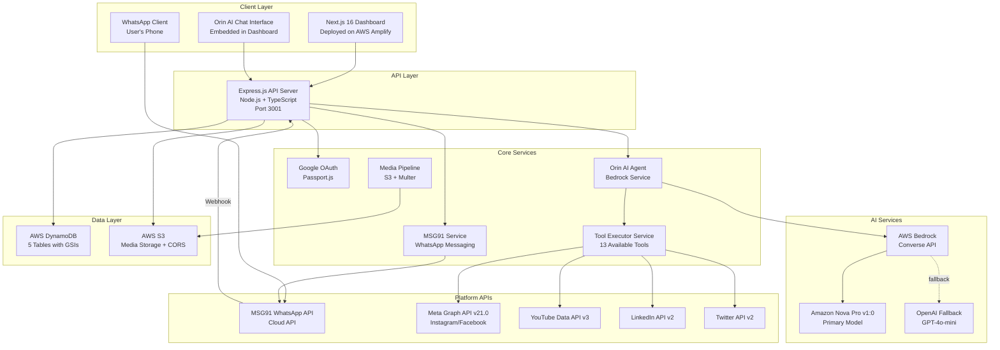
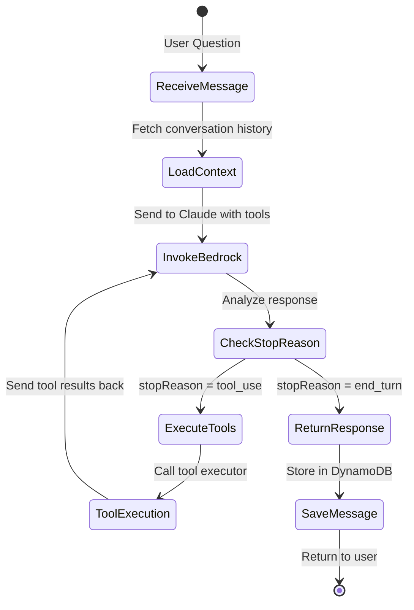

# Design Document

## Overview

SocialOS is an AI-powered social media management platform that enables content creators to manage their presence across multiple platforms (Instagram, YouTube, LinkedIn, Twitter/X) through an intelligent conversational interface. The system is built on AWS Bedrock (Claude 3 models) with OpenAI fallback, providing natural language command processing, automated content generation, cross-platform analytics, and intelligent scheduling.

The architecture consists of a Next.js 16 frontend deployed on AWS Amplify and a Node.js/Express backend with TypeScript. The system uses AWS DynamoDB for data storage, S3 for media files, and implements a sophisticated tool-calling pattern where the AI agent (Orin) can execute actions like posting content, fetching analytics, and generating captions through a unified tool executor service.

Key features include:
- **Orin AI Assistant**: Conversational AI powered by AWS Bedrock with tool execution capabilities
- **Multi-Platform Support**: Instagram, YouTube, LinkedIn, Twitter/X integration
- **Smart Analytics**: Real-time performance tracking with AI-generated insights
- **Content Generation**: AI-powered caption and video metadata generation
- **Conversation Memory**: Persistent chat history with context-aware responses
- **Connected Accounts**: OAuth-based platform authentication with token management

## Architecture

### High-Level System Architecture



### Agent Loop Architecture

The Orin AI agent implements a conversational tool-calling pattern powered by AWS Bedrock's Converse API:



**Key Components:**

1. **Context Loading**: Fetches last 6 messages from conversation history and connected accounts
2. **Tool Specification**: Passes 13 available tools to Bedrock (analytics, posting, caption generation)
3. **Tool Execution**: Delegates to ToolExecutorService which handles platform API calls
4. **Iterative Loop**: Continues until Claude generates final response (max 5 iterations)
5. **Conversation Persistence**: Stores all messages in DynamoDB with conversation threading

### Technology Stack

The system employs a modern full-stack architecture:

**Frontend:**
- Next.js 16 (React 19) with App Router
- TypeScript 5.7
- Tailwind CSS 4.2 for styling
- Radix UI for accessible components
- Framer Motion for animations
- Recharts for analytics visualization
- Deployed on AWS Amplify

**Backend:**
- Node.js 18+ with Express 4.21
- TypeScript 5.7
- Passport.js for OAuth authentication
- Multer + Multer-S3 for file uploads
- Axios for HTTP requests
- UUID for ID generation

**Infrastructure:**
- AWS DynamoDB (NoSQL database)
- AWS S3 (media storage)
- AWS Bedrock (AI models)
- AWS Amplify (frontend hosting)

**AI Models:**
- Primary: AWS Bedrock Amazon Nova Pro v1:0
- Fallback: OpenAI GPT-4o-mini
- Cross-region routing via inference profile ARN

**Platform APIs:**
- Instagram: Meta Graph API v21.0
- YouTube: YouTube Data API v3
- LinkedIn: LinkedIn API v2
- Twitter/X: Twitter API v2

## Components and Interfaces

### Core Components

#### Orin AI Agent (BedrockService)

The central intelligence component implementing conversational AI with tool execution:

```typescript
class BedrockService {
  // Core AI invocation with fallback
  private async invokeBedrock(prompt: string, maxTokens: number): Promise<string>
  private async invokeOpenAI(prompt: string, maxTokens: number): Promise<string>
  private async invokeWithFallback(prompt: string, maxTokens: number): Promise<string>
  
  // Content generation
  async generateCaption(prompt: string, platform: string, options?: CaptionOptions): Promise<string>
  async generateVideoMetadata(prompt: string, options?: VideoOptions): Promise<VideoMetadata>
  
  // Analytics and insights
  async analyzeContent(content: string): Promise<any>
  async summarizeAnalytics(analyticsData: any): Promise<string>
  
  // Conversational AI with tools
  async answerQuestionWithTools(
    question: string,
    context: any,
    toolExecutor: (toolName: string, toolInput: any) => Promise<string>,
    options?: { priorMessages?: Array<{ role: 'user' | 'assistant'; content: string }> }
  ): Promise<string>
}
```

**Key Features:**
- AWS Bedrock Converse API integration with Claude 3 models
- Automatic fallback to OpenAI if Bedrock fails
- Tool calling pattern for executing actions (13 available tools)
- Conversation history management (last 6 messages)
- Query detection for analytics, comments, and profile stats
- Iterative tool execution loop (max 5 iterations)

**Tool Detection Patterns:**
- Analytics queries: Detects keywords like "analytics", "performance", "metrics"
- Comment queries: Detects "latest comment", "top comments", "second last comment"
- Profile stats: Detects "followers", "subscribers", "profile stats"
- Connected accounts: Detects "connected accounts", "linked platforms"

#### Tool Executor Service

Unified service for executing AI-requested actions:

```typescript
class ToolExecutorService {
  async executeTool(toolName: string, toolInput: Record<string, any>, userId: string): Promise<string>
  
  // Analytics tools
  private async getInstagramAnalytics(userId: string, limit: number): Promise<string>
  private async getYoutubeAnalytics(userId: string, limit: number): Promise<string>
  private async getAllAnalyticsSummary(userId: string): Promise<string>
  private async getInstagramProfileStats(userId: string): Promise<string>
  private async getYoutubeChannelStats(userId: string): Promise<string>
  
  // Posting tools
  private async postToInstagram(userId: string, input: PostInput): Promise<string>
  private async postToYoutube(userId: string, input: VideoInput): Promise<string>
  private async postToMultiplePlatforms(userId: string, input: MultiPlatformInput): Promise<string>
  
  // Comment tools
  private async getInstagramComments(userId: string, input: CommentInput): Promise<string>
  private async getYoutubeComments(userId: string, input: CommentInput): Promise<string>
  private async getLatestComment(userId: string, input: LatestCommentInput): Promise<string>
  
  // Utility tools
  private async generateCaption(input: CaptionInput): Promise<string>
  private async getConnectedAccounts(userId: string): Promise<string>
}
```

**Available Tools (13 total):**
1. `get_instagram_analytics` - Fetch Instagram post metrics
2. `get_youtube_analytics` - Fetch YouTube video metrics
3. `get_all_analytics_summary` - Cross-platform analytics summary
4. `get_instagram_profile_stats` - Follower/following counts
5. `get_youtube_channel_stats` - Subscriber/view counts
6. `post_to_instagram` - Publish image/video to Instagram
7. `post_to_youtube` - Upload video to YouTube
8. `post_to_multiple_platforms` - Cross-post content
9. `generate_caption` - AI caption generation
10. `get_connected_accounts` - List connected platforms
11. `get_instagram_comments` - Fetch post comments
12. `get_youtube_comments` - Fetch video comments
13. `get_latest_comment` - Find most recent comment across posts

#### DynamoDB Service

Data access layer for all database operations:

```typescript
class DynamoDBService {
  // Basic CRUD operations
  async put(tableName: string, item: any): Promise<void>
  async get(tableName: string, key: any): Promise<any>
  async query(tableName: string, ...): Promise<any[]>
  async queryByIndex(tableName: string, indexName: string, ...): Promise<any[]>
  async update(tableName: string, key: any, ...): Promise<any>
  async delete(tableName: string, key: any): Promise<void>
  
  // Conversation management
  async createConversation(conversation: Conversation): Promise<Conversation>
  async getConversation(conversationId: string): Promise<Conversation>
  async listConversations(userId: string, limit: number): Promise<Conversation[]>
  async updateConversationTimestamp(conversationId: string, updatedAt: string): Promise<any>
  
  // Message management
  async createChatMessage(message: ChatMessage): Promise<ChatMessage>
  async listChatMessages(conversationId: string, limit: number): Promise<ChatMessage[]>
  
  // Post history
  async logPostHistory(entry: PostHistory): Promise<PostHistory>
  async listPostHistory(userId: string, limit: number): Promise<PostHistory[]>
}
```

#### Platform Services

Individual services for each social media platform:

**YouTube Service:**
```typescript
class YouTubeService {
  async exchangeCodeForTokens(code: string, redirectUri: string): Promise<TokenResponse>
  async refreshAccessToken(refreshToken: string): Promise<TokenResponse>
  isTokenExpired(tokenExpiry: string): boolean
  async uploadVideo(accessToken: string, title: string, description: string, tags: string[], videoUrl: string): Promise<any>
  async getChannelStats(channelId: string): Promise<any>
  async listChannelVideos(channelId: string, maxResults: number): Promise<any>
  async getVideoComments(videoId: string, maxResults: number): Promise<any>
}
```

**Meta Service (Instagram):**
```typescript
class MetaService {
  async getInstagramProfile(igAccountId: string, accessToken: string): Promise<any>
  async getInstagramMedia(igAccountId: string, limit: number, accessToken: string): Promise<any>
  async publishInstagramImage(igAccountId: string, imageUrl: string, caption: string, accessToken: string): Promise<any>
  async publishInstagramReel(igAccountId: string, videoUrl: string, caption: string, accessToken: string): Promise<any>
  async getInstagramComments(mediaId: string, limit: number, accessToken: string): Promise<any>
}
```

### Interface Specifications

#### REST API Endpoints

**Authentication:**
```
POST   /api/auth/google              # Initiate Google OAuth
GET    /api/auth/google/callback     # OAuth callback
POST   /api/auth/logout              # Logout user
GET    /api/auth/me                  # Get current user
```

**AI Operations:**
```
POST   /api/ai/generate-caption      # Generate AI caption
POST   /api/ai/analyze               # Analyze content
GET    /api/ai/recommendations/:userId  # Get AI recommendations
GET    /api/ai/summarize-analytics   # AI analytics summary (authenticated)
POST   /api/ai/ask                   # Chat with Orin AI (authenticated)
GET    /api/ai/conversation          # Get conversation history (authenticated)
```

**Instagram:**
```
GET    /api/instagram/profile        # Get profile stats
GET    /api/instagram/posts          # Get recent posts
GET    /api/instagram/comments/:postId  # Get post comments
POST   /api/instagram/connect        # Connect account
```

**YouTube:**
```
POST   /api/youtube/upload           # Upload video
GET    /api/youtube/channel          # Get channel stats
GET    /api/youtube/videos           # Get channel videos
GET    /api/youtube/comments/:videoId  # Get video comments
POST   /api/youtube/connect          # Connect account
```

**Posts:**
```
POST   /api/posts                    # Create new post
GET    /api/posts/:id                # Get post by ID
PUT    /api/posts/:id                # Update post
DELETE /api/posts/:id                # Delete post
POST   /api/posts/:id/publish        # Publish scheduled post
```

**Analytics:**
```
GET    /api/analytics/instagram      # Instagram analytics
GET    /api/analytics/youtube        # YouTube analytics
GET    /api/analytics/summary        # Cross-platform summary
POST   /api/analytics/sync           # Sync from platforms
```

**Dashboard:**
```
GET    /api/dashboard/overview       # Dashboard overview data
GET    /api/dashboard/recent-activity  # Recent activity feed
```

**Users:**
```
GET    /api/users/:id                # Get user profile
PUT    /api/users/:id                # Update user profile
GET    /api/users/:id/connected-accounts  # Get connected accounts
```

#### Frontend Routes (Next.js App Router)

```
/                                    # Landing page (redirects to /dashboard or /login)
/login                               # Authentication page
/dashboard                           # Main dashboard
/dashboard?section=create            # Create post section
/dashboard?section=orin              # Orin AI chat
/dashboard?section=analytics         # Analytics section
/dashboard?section=library           # Content library
/dashboard?section=schedule          # Schedule posts
/dashboard?section=whatsapp          # WhatsApp settings
/dashboard?section=settings          # Settings
/auth/callback                       # OAuth callback handler
```

#### WhatsApp Integration (MSG91)

**Architecture:**
- MSG91 WhatsApp Cloud API for messaging
- Webhook endpoint receives inbound messages
- Automatic user creation by phone number
- Full Orin AI capabilities via WhatsApp
- Conversation memory with persistent history

**Message Flow:**
```
User sends WhatsApp message
    ↓
MSG91 receives message
    ↓
MSG91 webhook → POST /webhooks/msg91/whatsapp
    ↓
WhatsApp Controller:
  - Parse message payload
  - Get/create user by phone number (format: whatsapp_<number>@orin.ai)
  - Get/create conversation thread
  - Load last 6 messages for context
  - Process through Orin AI with tool execution
  - Save user message and AI response
  - Send response via MSG91 API
    ↓
User receives AI response on WhatsApp
```

**Security:**
- Users must link WhatsApp number in dashboard before accessing data
- Phone number verification prevents unauthorized access
- One phone number per account
- Unverified numbers receive link instruction message

**Webhook Endpoints:**
```
POST   /webhooks/msg91/whatsapp      # Inbound message webhook
GET    /webhooks/msg91/whatsapp/health  # Health check
```

**User Management:**
```
POST   /api/user/whatsapp/link       # Link WhatsApp number (authenticated)
DELETE /api/user/whatsapp/unlink     # Unlink WhatsApp number (authenticated)
GET    /api/user/whatsapp/status     # Check WhatsApp status (authenticated)
```

**Supported Features via WhatsApp:**
- Analytics queries ("Show me my Instagram analytics")
- Comment management ("What was the last comment?")
- Content generation ("Generate a caption")
- General research questions
- All 13 AI tools available

**Configuration:**
```env
MSG91_AUTH_KEY=your_auth_key
MSG91_WHATSAPP_NUMBER=15558335359
MSG91_BASE_URL=https://control.msg91.com/api/v5
```

#### Conversation Management

**Chat Interface:**
- Persistent conversation threads stored in DynamoDB
- Each conversation has unique ID and title
- Messages stored with role (user/assistant), content, and timestamp
- Conversation history loaded (last 6 messages) for context
- Automatic conversation creation on first message
- Conversation list sorted by last updated timestamp

**Message Flow:**
1. User sends question via `/api/ai/ask`
2. System loads or creates conversation
3. Fetches last 6 messages for context
4. Loads connected accounts and post history
5. Invokes Bedrock with tools and conversation history
6. Executes any requested tools
7. Stores user message and AI response
8. Updates conversation timestamp
9. Returns response with conversation ID

## Data Models

### DynamoDB Tables

The system uses AWS DynamoDB with the following tables (prefix: `social_media_`):

#### 1. connected_accounts

Stores OAuth credentials and metadata for connected social media accounts.

```typescript
interface ConnectedAccount {
  id: string                    // Partition key (UUID)
  userId: string                // GSI: UserPlatformIndex
  platform: 'instagram' | 'youtube' | 'linkedin' | 'twitter'  // GSI: UserPlatformIndex
  platformAccountId: string     // Platform-specific account ID
  platformUsername: string      // Display username
  accessToken: string           // OAuth access token (encrypted)
  refreshToken?: string         // OAuth refresh token (encrypted)
  tokenExpiry?: string          // Token expiration timestamp
  isActive: boolean             // Account status
  metadata?: Record<string, any>  // Platform-specific metadata
  createdAt: string             // ISO timestamp
  updatedAt: string             // ISO timestamp
}

// Global Secondary Index
UserPlatformIndex: userId (PK) + platform (SK)
```

#### 2. chat_conversations

Stores conversation threads for Orin AI chat interface.

```typescript
interface Conversation {
  id: string                    // Partition key (UUID)
  userId: string                // GSI: UserIdUpdatedAtIndex
  title: string                 // Conversation title (first 60 chars of first message)
  createdAt: string             // ISO timestamp
  updatedAt: string             // ISO timestamp, GSI: UserIdUpdatedAtIndex
  metadata?: Record<string, any>  // Additional conversation data
}

// Global Secondary Index
UserIdUpdatedAtIndex: userId (PK) + updatedAt (SK)
```

#### 3. chat_messages

Stores individual messages within conversations.

```typescript
interface ChatMessage {
  id: string                    // Partition key (UUID)
  conversationId: string        // GSI: ConversationCreatedAtIndex
  userId: string                // Message owner
  role: 'user' | 'assistant' | 'system'  // Message role
  content: string               // Message text
  createdAt: string             // ISO timestamp, GSI: ConversationCreatedAtIndex
  metadata?: {
    toolCalls?: ToolCall[]      // Tools executed during this message
    reasoning?: string          // AI reasoning process
  }
}

// Global Secondary Index
ConversationCreatedAtIndex: conversationId (PK) + createdAt (SK)
```

#### 4. post_history

Logs all posting actions for audit and analytics.

```typescript
interface PostHistory {
  id: string                    // Partition key (userId_timestamp)
  userId: string                // GSI: UserIdIndex
  platform: 'instagram' | 'youtube' | 'linkedin' | 'twitter'
  postId: string                // Platform-specific post ID
  caption?: string              // Post caption/description
  mediaUrl?: string             // Media file URL
  status: 'published' | 'failed' | 'scheduled'
  errorMessage?: string         // Error details if failed
  scheduledFor: string          // ISO timestamp
  createdAt: string             // ISO timestamp
}

// Global Secondary Index
UserIdIndex: userId (PK)
```

#### 5. users (Managed by Google OAuth)

User profiles and authentication data.

```typescript
interface User {
  id: string                    // Partition key (Google OAuth ID)
  email: string                 // User email
  name: string                  // Display name
  profilePicture?: string       // Avatar URL
  createdAt: string             // ISO timestamp
  updatedAt: string             // ISO timestamp
}
```

### Data Access Patterns

**Common Queries:**

1. **Get user's connected accounts:**
   ```typescript
   queryByIndex('connected_accounts', 'UserPlatformIndex', 
     'userId = :userId', { ':userId': userId })
   ```

2. **Get user's conversations (sorted by recent):**
   ```typescript
   queryByIndex('chat_conversations', 'UserIdUpdatedAtIndex',
     'userId = :userId', { ':userId': userId })
   // Sort by updatedAt descending, limit 20
   ```

3. **Get conversation messages:**
   ```typescript
   queryByIndex('chat_messages', 'ConversationCreatedAtIndex',
     'conversationId = :conversationId', { ':conversationId': conversationId })
   // Sort by createdAt ascending, limit 50
   ```

4. **Get user's post history:**
   ```typescript
   queryByIndex('post_history', 'UserIdIndex',
     'userId = :userId', { ':userId': userId })
   // Limit 50, sorted by createdAt descending
   ```

### S3 Storage Structure

Media files stored in AWS S3 bucket:

```
s3://social-media-content-{timestamp}/
├── uploads/
│   ├── {userId}/
│   │   ├── {postId}/
│   │   │   ├── original.jpg
│   │   │   ├── thumbnail.jpg
│   │   │   └── video.mp4
│   │   └── ...
│   └── ...
└── temp/
    └── {uploadId}/
        └── ...
```

**S3 Configuration:**
- CORS enabled for frontend uploads
- Signed URLs with expiration for secure access
- Bucket policies for user-specific access
- Lifecycle policies for temp file cleanup

## Correctness Properties

*A property is a characteristic or behavior that should hold true across all valid executions of a system—essentially, a formal statement about what the system should do. Properties serve as the bridge between human-readable specifications and machine-verifiable correctness guarantees.*

Based on the prework analysis of acceptance criteria, the following properties ensure system correctness across all valid inputs and scenarios:

### Core Agent Loop Properties

**Property 1: Natural Language Command Processing**
*For any* valid natural language command, the Orin agent should successfully parse the intent and extract actionable parameters, or request clarification if the command is ambiguous.
**Validates: Requirements 2.1, 2.5**

**Property 2: Cross-Interface State Consistency**
*For any* user action performed in one interface (dashboard, chat, WhatsApp), the resulting state changes should be immediately reflected across all other interfaces for that user.
**Validates: Requirements 1.5**

### WhatsApp Integration Properties

**Property 3: WhatsApp Message Processing Pipeline**
*For any* WhatsApp message (text, voice, or media), the system should process it through the MSG91 API, maintain conversational context, and handle voice transcription when applicable.
**Validates: Requirements 1.3, 4.1, 4.2, 4.3, 17.1, 17.2**

**Property 4: WhatsApp Error Recovery**
*For any* WhatsApp processing failure (voice transcription, API errors), the system should request user clarification or alternative input methods while preserving conversation state.
**Validates: Requirements 4.4, 17.4**

**Property 5: Concurrent WhatsApp Conversations**
*For any* set of concurrent WhatsApp conversations, the system should maintain separate conversational states without cross-contamination between users.
**Validates: Requirements 17.5**

### Account Alias Management Properties

**Property 6: Alias Resolution and Creation**
*For any* account alias operation (creation, resolution, validation), the system should maintain uniqueness within user accounts and correctly map aliases to platform credentials.
**Validates: Requirements 2.2, 5.1, 5.2, 5.5**

**Property 7: Alias Error Handling**
*For any* failed alias resolution, the system should prompt users to clarify or create the missing alias while supporting multiple aliases per platform account.
**Validates: Requirements 5.3, 5.4**

### Content and Media Properties

**Property 8: Multi-Platform Content Adaptation**
*For any* posting command targeting multiple platforms, the system should adapt content format to each platform's specific requirements and constraints.
**Validates: Requirements 3.3**

**Property 9: Media Pipeline Processing**
*For any* uploaded media file, the system should store it securely in Cloudflare R2, generate signed URLs with appropriate expiration, and optimize content for platform requirements.
**Validates: Requirements 6.1, 6.2, 6.3, 6.5**

**Property 10: Scheduling and Time Conversion**
*For any* scheduling command with relative time expressions, the system should convert them to absolute timestamps and queue posts appropriately.
**Validates: Requirements 2.4**

### Safety and Validation Properties

**Property 11: Comprehensive Safety Validation**
*For any* content (posts, replies, media), the Safety Layer should validate against platform policies, route low-confidence content to human review, and block harmful content while alerting administrators.
**Validates: Requirements 7.2, 11.1, 11.2, 11.3**

**Property 12: Safety Configuration Flexibility**
*For any* user and content type combination, the system should maintain configurable safety thresholds and apply them consistently during validation.
**Validates: Requirements 11.5**

### Platform Integration Properties

**Property 13: Secure Platform Authentication**
*For any* social media platform account connection, the system should store authentication tokens using encryption at rest and validate them during API access.
**Validates: Requirements 3.2, 15.2**

**Property 14: Platform API Error Handling**
*For any* platform API failure, the system should log the failure, notify the user, respect rate limits, and implement appropriate retry logic.
**Validates: Requirements 3.4, 3.5, 18.3**

### Collaboration and Campaign Properties

**Property 15: Creator Collaboration Workflow**
*For any* collaboration request, the system should provide realtime chat, create shared workspaces upon agreement, coordinate cross-posting schedules, and track performance metrics for both parties.
**Validates: Requirements 8.2, 8.3, 8.4, 8.5**

**Property 16: Campaign Management Integrity**
*For any* agency campaign, the system should support multi-creator coordination, track budgets across all participants, provide transparent bidding processes, and generate comprehensive reports.
**Validates: Requirements 9.1, 9.2, 9.3, 9.5**

### Analytics and Insights Properties

**Property 17: Performance Analysis and Recommendations**
*For any* post performance data, the system should identify engagement patterns, generate platform-specific growth suggestions, calculate optimal posting times, and provide actionable insights aligned with creator profiles.
**Validates: Requirements 10.1, 10.2, 10.3, 10.4, 10.5**

### System Infrastructure Properties

**Property 18: Comprehensive Audit Logging**
*For any* system action, API call, or data modification, the system should create immutable audit records with complete details and generate compliance reports on demand.
**Validates: Requirements 7.4, 11.4, 12.1, 12.2, 12.3, 12.4**

**Property 19: Cost-Optimized AI Model Routing**
*For any* task requiring AI processing, the Task Router should select the most cost-effective model based on complexity, log usage for optimization, and implement failover for performance degradation.
**Validates: Requirements 13.1, 13.2, 13.3, 13.4**

**Property 20: Queue Management and Scaling**
*For any* background job (scheduled posts, processing tasks), the system should queue them reliably, implement retry logic with exponential backoff, scale workers automatically, and provide realtime status updates.
**Validates: Requirements 16.1, 16.2, 16.3, 16.4**

**Property 21: Multi-Channel Notification Delivery**
*For any* system event requiring user notification (successful posts, collaboration requests, campaign opportunities, errors), the system should deliver notifications through appropriate channels with immediate feedback.
**Validates: Requirements 14.1, 14.2, 14.3, 14.4, 14.5**

**Property 22: Authentication and Authorization**
*For any* user registration or API access request, the system should enforce secure authentication requirements, validate JWT tokens and permissions, and implement role-based access control.
**Validates: Requirements 15.1, 15.3, 15.5**

<function_calls>
<invoke name="prework">
<parameter name="featureName">socialos

## Error Handling

### Error Classification and Response Strategy

The system implements a comprehensive error handling strategy with categorized responses based on error severity and user impact:

#### Critical Errors (System-Level Failures)
- **Database Connection Failures**: Automatic failover to read replicas, circuit breaker activation
- **AI Service Outages**: Model failover routing, graceful degradation to simpler models
- **External API Complete Failures**: Queue job retry with exponential backoff, user notification

#### User-Facing Errors (Recoverable Issues)
- **Invalid Commands**: Natural language clarification requests with suggested corrections
- **Authentication Failures**: Clear error messages with re-authentication prompts
- **Content Validation Failures**: Specific feedback with improvement suggestions
- **Rate Limit Exceeded**: Automatic queuing with estimated retry times

#### Background Processing Errors
- **Queue Job Failures**: Exponential backoff retry (3 attempts), dead letter queue for manual review
- **Scheduled Post Failures**: User notification with rescheduling options
- **Media Processing Failures**: Alternative format attempts, user notification if all fail

### Error Recovery Mechanisms

```typescript
interface ErrorRecoveryStrategy {
  classify(error: Error): ErrorCategory;
  recover(error: Error, context: OperationContext): RecoveryAction;
  notify(error: Error, user: User): NotificationStrategy;
}

enum ErrorCategory {
  TRANSIENT = "transient",      // Retry automatically
  USER_INPUT = "user_input",    // Request clarification
  SYSTEM = "system",            // Escalate to operations
  EXTERNAL = "external"         // Circuit breaker logic
}
```

### Monitoring and Alerting

- **Real-time Error Tracking**: Structured logging with correlation IDs
- **Performance Monitoring**: Response time tracking, SLA violation alerts
- **Business Logic Monitoring**: Content validation failure rates, user satisfaction metrics
- **Infrastructure Monitoring**: Database performance, queue depth, AI service latency

## Testing Strategy

### Dual Testing Approach

The SocialOS testing strategy employs both unit testing and property-based testing to ensure comprehensive coverage and system reliability:

#### Property-Based Testing
Property-based tests validate universal correctness properties across all possible inputs using randomized test data generation. Each property test runs a minimum of 100 iterations to ensure statistical confidence.

**Configuration**: 
- **Framework**: fast-check (JavaScript/TypeScript property testing library)
- **Iterations**: 100 minimum per property test
- **Timeout**: 30 seconds per property test suite
- **Shrinking**: Automatic minimal failing case identification

**Property Test Implementation Pattern**:
```typescript
// Example property test structure
describe('SocialOS Property Tests', () => {
  it('Property 1: Natural Language Command Processing', () => {
    fc.assert(fc.property(
      fc.record({
        command: fc.string({ minLength: 5, maxLength: 200 }),
        userId: fc.uuid(),
        platform: fc.constantFrom('x', 'linkedin', 'instagram')
      }),
      async (testData) => {
        // Feature: socialos, Property 1: Natural Language Command Processing
        const result = await orinAgent.processCommand(testData.command, testData.userId);
        
        // Either successfully parsed or requested clarification
        expect(result.success || result.clarificationRequested).toBe(true);
        
        // If successful, should have actionable parameters
        if (result.success) {
          expect(result.parameters).toBeDefined();
          expect(result.intent).toBeDefined();
        }
      }
    ), { numRuns: 100 });
  });
});
```

**Property Test Coverage**:
- Each of the 22 correctness properties has a dedicated property-based test
- Tests use randomized data generation for comprehensive input coverage
- Automatic shrinking identifies minimal failing cases for debugging
- Cross-platform compatibility testing with random platform combinations

#### Unit Testing
Unit tests focus on specific examples, edge cases, and integration points that complement property-based testing:

**Unit Test Focus Areas**:
- **API Endpoint Testing**: Specific request/response validation
- **Database Integration**: Transaction handling, constraint validation
- **External Service Mocking**: Platform API integration testing
- **Edge Case Validation**: Boundary conditions, error scenarios
- **Security Testing**: Authentication, authorization, input sanitization

**Unit Test Examples**:
```typescript
describe('WhatsApp Integration', () => {
  it('should handle voice note transcription failure gracefully', async () => {
    // Specific edge case testing
    const mockVoiceNote = createMockVoiceNote({ corrupted: true });
    const result = await whatsappHandler.processVoiceNote(mockVoiceNote);
    
    expect(result.success).toBe(false);
    expect(result.fallbackRequested).toBe(true);
    expect(result.message).toContain('Please try sending a text message');
  });
  
  it('should maintain conversation context across message sequences', async () => {
    // Integration testing with specific scenarios
    const userId = 'test-user-123';
    const messages = [
      'Post this to my personal X',
      'Actually, make it Instagram instead',
      'And schedule it for tomorrow at 9am'
    ];
    
    for (const message of messages) {
      await whatsappHandler.processMessage(userId, message);
    }
    
    const context = await whatsappHandler.getConversationContext(userId);
    expect(context.pendingActions).toHaveLength(1);
    expect(context.pendingActions[0].platform).toBe('instagram');
    expect(context.pendingActions[0].scheduledTime).toBeDefined();
  });
});
```

### Test Environment Strategy

**Development Testing**:
- Local development with Docker Compose for service dependencies
- Mock external APIs (X, LinkedIn, Instagram) for isolated testing
- In-memory Redis for queue testing
- Test database with realistic data fixtures

**Staging Testing**:
- Full integration testing with sandbox APIs where available
- Load testing with realistic user scenarios
- End-to-end testing across all interfaces (dashboard, chat, WhatsApp)
- Performance benchmarking against SLA requirements

**Production Monitoring**:
- Synthetic transaction monitoring for critical user flows
- Real-time error rate monitoring with alerting
- Performance regression detection
- A/B testing framework for feature rollouts

### Continuous Integration Pipeline

```yaml
# Example CI/CD pipeline structure
stages:
  - unit_tests:
      - Run Jest unit tests
      - Generate coverage reports (minimum 80%)
      - Validate TypeScript compilation
  
  - property_tests:
      - Run fast-check property tests (100 iterations each)
      - Validate all 22 correctness properties
      - Generate property test reports
  
  - integration_tests:
      - Start Docker Compose test environment
      - Run API integration tests
      - Test WhatsApp webhook handling
      - Validate database migrations
  
  - security_tests:
      - Run OWASP dependency check
      - Validate authentication flows
      - Test input sanitization
      - Check for sensitive data exposure
  
  - performance_tests:
      - Load test critical endpoints
      - Validate response time SLAs
      - Test queue processing under load
      - Memory and CPU usage validation
```

### Test Data Management

**Property Test Data Generation**:
- Randomized user profiles with realistic constraints
- Generated social media content following platform guidelines
- Synthetic voice notes and media files for processing tests
- Randomized scheduling scenarios across timezones

**Unit Test Fixtures**:
- Predefined user accounts with various permission levels
- Sample social media posts for each supported platform
- Mock API responses for external service testing
- Database fixtures with referential integrity

**Test Data Privacy**:
- No production data used in testing environments
- Synthetic data generation for realistic testing scenarios
- Automated data cleanup after test execution
- Compliance with data protection regulations

This comprehensive testing strategy ensures that SocialOS maintains high reliability and correctness across all user scenarios while providing rapid feedback during development and deployment processes.