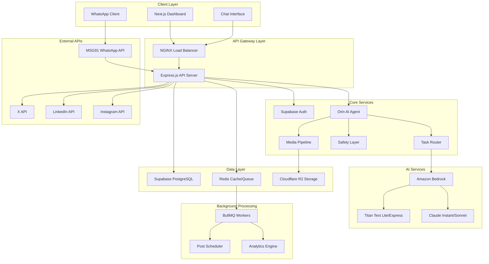
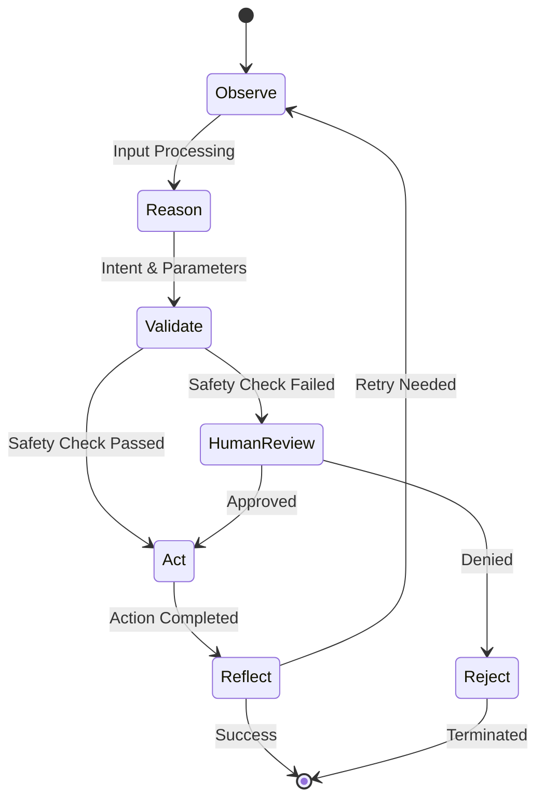
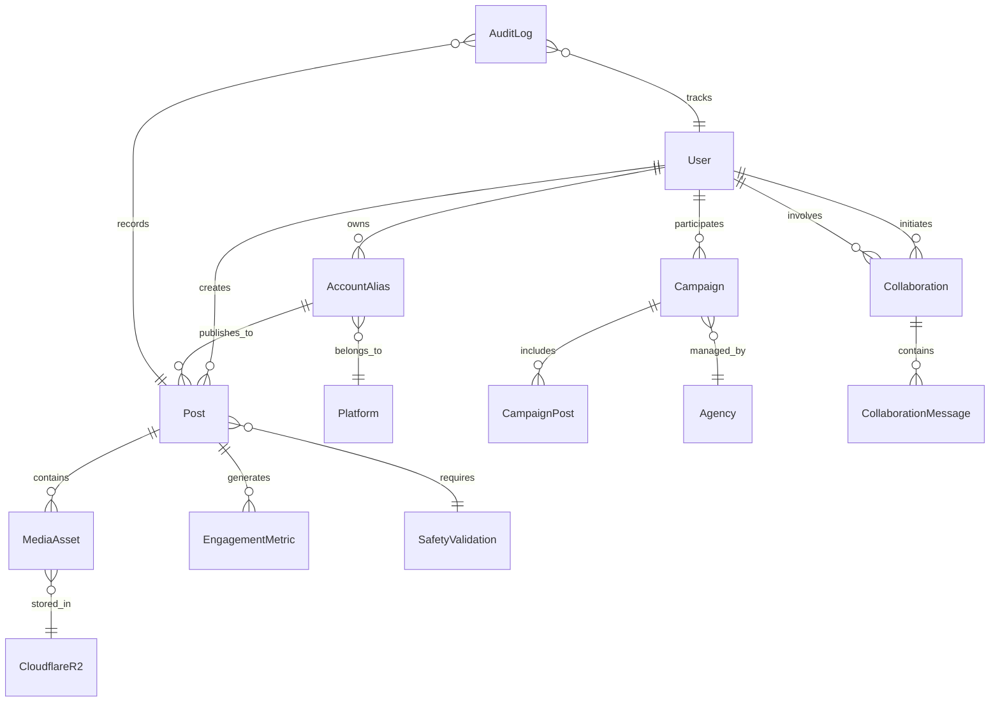

# Design Document

## Overview

SocialOS is an enterprise-grade agentic AI creator operating system that enables creators and agencies to automate social media operations through natural language interfaces. The system implements a sophisticated AI agent loop (Observe → Reason → Validate → Act → Reflect) powered by Amazon Bedrock's multi-model approach, with cost-optimized routing between Titan Text models for simple tasks and Claude models for complex reasoning.

The architecture supports three primary interfaces: a Next.js dashboard for traditional management, a conversational chat UI for natural language commands, and WhatsApp integration via MSG91 Cloud API for voice-driven workflows. The system processes voice notes, images, and documents through a comprehensive media pipeline while maintaining enterprise-grade security, audit logging, and safety validation.

Key differentiators include the account alias system for intuitive platform references, sophisticated creator-to-creator collaboration with realtime communication, agency marketplace functionality, and comprehensive safety layers with configurable confidence thresholds and human review queues.

## Architecture

### High-Level System Architecture



### Agent Loop Architecture



### Microservices Architecture

The system employs a modular microservices approach with the following core services:

1. **API Gateway Service**: NGINX-based load balancing and request routing
2. **Authentication Service**: Supabase-powered user management and JWT validation
3. **Orin Agent Service**: Core AI reasoning and command processing
4. **Task Router Service**: Cost-optimized AI model selection and routing
5. **Safety Validation Service**: Content moderation and confidence scoring
6. **Media Processing Service**: File upload, processing, and CDN management
7. **Social Platform Service**: Multi-platform API integration and posting
8. **Queue Management Service**: Redis/BullMQ-based background job processing
9. **Analytics Service**: Performance tracking and growth recommendations
10. **Notification Service**: Realtime updates via WebSockets and external channels

## Components and Interfaces

### Core Components

#### Orin AI Agent
The central intelligence component implementing the agent loop pattern:

**Observe Phase**:
- Input parsing from multiple channels (dashboard, chat, WhatsApp)
- Context extraction from conversational history
- Media content analysis and metadata extraction
- User intent classification using natural language processing

**Reason Phase**:
- Command interpretation and parameter extraction
- Account alias resolution to platform credentials
- Scheduling logic for time-based commands
- Multi-platform content adaptation requirements

**Validate Phase**:
- Safety layer integration for content validation
- Platform policy compliance checking
- User permission and quota validation
- Confidence scoring for automated actions

**Act Phase**:
- Social media API calls with retry logic
- Database updates and audit logging
- Queue job creation for background processing
- Realtime notification dispatch

**Reflect Phase**:
- Action result analysis and success validation
- Error handling and retry decision logic
- Learning from user feedback and corrections
- Performance metrics collection

#### Task Router
Intelligent AI model selection based on task complexity and cost optimization:

```typescript
interface TaskRouter {
  routeTask(task: Task, context: Context): ModelSelection;
  getCostEstimate(task: Task, model: AIModel): CostEstimate;
  handleFailover(failedModel: AIModel, task: Task): ModelSelection;
}

enum TaskComplexity {
  SIMPLE = "simple",      // Titan Text Lite
  MODERATE = "moderate",  // Titan Text Express
  COMPLEX = "complex",    // Claude Instant
  ADVANCED = "advanced"   // Claude Sonnet
}
```

**Routing Logic**:
- Simple text parsing and basic commands → Titan Text Lite ($0.0001/1K tokens)
- Content generation and scheduling → Titan Text Express ($0.0002/1K tokens)
- Complex reasoning and safety validation → Claude Instant ($0.0008/1K tokens)
- Advanced creative tasks and collaboration → Claude Sonnet ($0.003/1K tokens)

#### Safety Layer
Multi-tiered content validation system with configurable thresholds:

```typescript
interface SafetyLayer {
  validateContent(content: Content): SafetyResult;
  checkPlatformCompliance(content: Content, platform: Platform): ComplianceResult;
  routeToHumanReview(content: Content, reason: string): ReviewTicket;
}

interface SafetyResult {
  confidence: number;        // 0-1 confidence score
  approved: boolean;         // Auto-approval decision
  flags: SafetyFlag[];      // Identified concerns
  humanReviewRequired: boolean;
}
```

**Safety Thresholds**:
- Confidence > 0.9: Auto-approve
- Confidence 0.7-0.9: Platform-specific review
- Confidence < 0.7: Mandatory human review

#### Media Pipeline
Comprehensive media processing and storage system:

```typescript
interface MediaPipeline {
  uploadMedia(file: File, metadata: MediaMetadata): Promise<MediaAsset>;
  processMedia(asset: MediaAsset): Promise<ProcessedMedia>;
  generateSignedUrl(assetId: string, expiration: number): Promise<string>;
  optimizeForPlatform(media: MediaAsset, platform: Platform): Promise<OptimizedMedia>;
}
```

**Processing Capabilities**:
- Image optimization (WebP conversion, compression, resizing)
- Video transcoding (MP4 standardization, compression)
- Audio transcription for voice notes
- Metadata extraction and content analysis
- Platform-specific format adaptation

### Interface Specifications

#### WhatsApp Integration
MSG91 WhatsApp Cloud API integration with conversational state management:

```typescript
interface WhatsAppHandler {
  processIncomingMessage(webhook: WhatsAppWebhook): Promise<void>;
  sendMessage(userId: string, message: WhatsAppMessage): Promise<void>;
  handleVoiceNote(audioFile: Buffer): Promise<TranscriptionResult>;
  maintainConversationState(userId: string, context: ConversationContext): void;
}

interface ConversationContext {
  userId: string;
  sessionId: string;
  messageHistory: Message[];
  currentIntent: Intent | null;
  pendingActions: PendingAction[];
  lastActivity: Date;
}
```

**Voice Workflow**:
1. Voice note received via WhatsApp webhook
2. Audio file downloaded and processed through speech-to-text
3. Transcribed text processed through Orin agent loop
4. Response generated and sent back via WhatsApp
5. Conversational context maintained for follow-up interactions

#### Social Platform APIs
Unified interface for multi-platform social media operations:

```typescript
interface SocialPlatformService {
  authenticateUser(platform: Platform, credentials: OAuthCredentials): Promise<AuthResult>;
  postContent(platform: Platform, content: PostContent): Promise<PostResult>;
  schedulePost(platform: Platform, content: PostContent, scheduledTime: Date): Promise<ScheduleResult>;
  getEngagementMetrics(platform: Platform, postId: string): Promise<EngagementMetrics>;
}

interface PostContent {
  text?: string;
  media?: MediaAsset[];
  hashtags?: string[];
  mentions?: string[];
  platformSpecific?: Record<string, any>;
}
```

**Platform-Specific Adaptations**:
- **X (Twitter)**: Character limits, thread handling, media constraints
- **LinkedIn**: Professional tone validation, article vs. post format
- **Instagram**: Image-first content, story vs. feed posting, hashtag optimization

#### Account Alias System
Natural language mapping for social media accounts:

```typescript
interface AccountAliasService {
  createAlias(userId: string, alias: string, platformAccount: PlatformAccount): Promise<void>;
  resolveAlias(userId: string, alias: string): Promise<PlatformAccount>;
  listAliases(userId: string): Promise<AccountAlias[]>;
  validateAliasUniqueness(userId: string, alias: string): Promise<boolean>;
}

interface AccountAlias {
  id: string;
  userId: string;
  alias: string;           // e.g., "personal X", "main Instagram"
  platform: Platform;
  accountId: string;
  displayName: string;
  isActive: boolean;
}
```

## Data Models

### Core Entity Relationships



### Database Schema

#### Users and Authentication
```sql
-- Managed by Supabase Auth
CREATE TABLE profiles (
  id UUID REFERENCES auth.users(id) PRIMARY KEY,
  email TEXT UNIQUE NOT NULL,
  full_name TEXT,
  avatar_url TEXT,
  user_type user_type_enum NOT NULL DEFAULT 'creator',
  created_at TIMESTAMPTZ DEFAULT NOW(),
  updated_at TIMESTAMPTZ DEFAULT NOW()
);

CREATE TYPE user_type_enum AS ENUM ('creator', 'agency', 'admin');
```

#### Account Management
```sql
CREATE TABLE account_aliases (
  id UUID PRIMARY KEY DEFAULT gen_random_uuid(),
  user_id UUID REFERENCES profiles(id) ON DELETE CASCADE,
  alias TEXT NOT NULL,
  platform platform_enum NOT NULL,
  platform_account_id TEXT NOT NULL,
  platform_username TEXT,
  access_token TEXT ENCRYPTED,
  refresh_token TEXT ENCRYPTED,
  token_expires_at TIMESTAMPTZ,
  is_active BOOLEAN DEFAULT true,
  created_at TIMESTAMPTZ DEFAULT NOW(),
  UNIQUE(user_id, alias)
);

CREATE TYPE platform_enum AS ENUM ('x', 'linkedin', 'instagram');
```

#### Content and Media
```sql
CREATE TABLE posts (
  id UUID PRIMARY KEY DEFAULT gen_random_uuid(),
  user_id UUID REFERENCES profiles(id) ON DELETE CASCADE,
  account_alias_id UUID REFERENCES account_aliases(id),
  content TEXT NOT NULL,
  platform_post_id TEXT,
  status post_status_enum DEFAULT 'draft',
  scheduled_for TIMESTAMPTZ,
  published_at TIMESTAMPTZ,
  safety_validation_id UUID REFERENCES safety_validations(id),
  created_at TIMESTAMPTZ DEFAULT NOW(),
  updated_at TIMESTAMPTZ DEFAULT NOW()
);

CREATE TYPE post_status_enum AS ENUM ('draft', 'scheduled', 'published', 'failed', 'deleted');

CREATE TABLE media_assets (
  id UUID PRIMARY KEY DEFAULT gen_random_uuid(),
  user_id UUID REFERENCES profiles(id) ON DELETE CASCADE,
  filename TEXT NOT NULL,
  content_type TEXT NOT NULL,
  file_size BIGINT NOT NULL,
  cloudflare_key TEXT NOT NULL,
  cloudflare_url TEXT NOT NULL,
  metadata JSONB,
  created_at TIMESTAMPTZ DEFAULT NOW()
);

CREATE TABLE post_media (
  post_id UUID REFERENCES posts(id) ON DELETE CASCADE,
  media_asset_id UUID REFERENCES media_assets(id) ON DELETE CASCADE,
  display_order INTEGER NOT NULL,
  PRIMARY KEY (post_id, media_asset_id)
);
```

#### Safety and Validation
```sql
CREATE TABLE safety_validations (
  id UUID PRIMARY KEY DEFAULT gen_random_uuid(),
  content_hash TEXT NOT NULL,
  content_type validation_type_enum NOT NULL,
  confidence_score DECIMAL(3,2) NOT NULL,
  ai_model TEXT NOT NULL,
  validation_result JSONB NOT NULL,
  human_review_required BOOLEAN DEFAULT false,
  human_reviewer_id UUID REFERENCES profiles(id),
  human_review_result validation_result_enum,
  human_review_notes TEXT,
  created_at TIMESTAMPTZ DEFAULT NOW(),
  reviewed_at TIMESTAMPTZ
);

CREATE TYPE validation_type_enum AS ENUM ('post_content', 'comment_reply', 'media_content');
CREATE TYPE validation_result_enum AS ENUM ('approved', 'rejected', 'needs_modification');
```

#### Collaboration and Campaigns
```sql
CREATE TABLE collaborations (
  id UUID PRIMARY KEY DEFAULT gen_random_uuid(),
  initiator_id UUID REFERENCES profiles(id) ON DELETE CASCADE,
  collaborator_id UUID REFERENCES profiles(id) ON DELETE CASCADE,
  title TEXT NOT NULL,
  description TEXT,
  status collaboration_status_enum DEFAULT 'pending',
  terms JSONB,
  created_at TIMESTAMPTZ DEFAULT NOW(),
  updated_at TIMESTAMPTZ DEFAULT NOW()
);

CREATE TYPE collaboration_status_enum AS ENUM ('pending', 'active', 'completed', 'cancelled');

CREATE TABLE campaigns (
  id UUID PRIMARY KEY DEFAULT gen_random_uuid(),
  agency_id UUID REFERENCES profiles(id) ON DELETE CASCADE,
  title TEXT NOT NULL,
  description TEXT,
  budget_total DECIMAL(10,2),
  budget_per_creator DECIMAL(10,2),
  target_audience JSONB,
  requirements JSONB,
  status campaign_status_enum DEFAULT 'draft',
  starts_at TIMESTAMPTZ,
  ends_at TIMESTAMPTZ,
  created_at TIMESTAMPTZ DEFAULT NOW()
);

CREATE TYPE campaign_status_enum AS ENUM ('draft', 'active', 'paused', 'completed', 'cancelled');
```

#### Analytics and Engagement
```sql
CREATE TABLE engagement_metrics (
  id UUID PRIMARY KEY DEFAULT gen_random_uuid(),
  post_id UUID REFERENCES posts(id) ON DELETE CASCADE,
  platform platform_enum NOT NULL,
  likes_count INTEGER DEFAULT 0,
  comments_count INTEGER DEFAULT 0,
  shares_count INTEGER DEFAULT 0,
  impressions_count INTEGER DEFAULT 0,
  reach_count INTEGER DEFAULT 0,
  engagement_rate DECIMAL(5,4),
  collected_at TIMESTAMPTZ DEFAULT NOW()
);

CREATE TABLE growth_insights (
  id UUID PRIMARY KEY DEFAULT gen_random_uuid(),
  user_id UUID REFERENCES profiles(id) ON DELETE CASCADE,
  insight_type insight_type_enum NOT NULL,
  insight_data JSONB NOT NULL,
  confidence_score DECIMAL(3,2),
  generated_by TEXT NOT NULL,
  created_at TIMESTAMPTZ DEFAULT NOW()
);

CREATE TYPE insight_type_enum AS ENUM ('optimal_posting_time', 'content_recommendation', 'hashtag_suggestion', 'engagement_pattern');
```

#### Audit and Compliance
```sql
CREATE TABLE audit_logs (
  id UUID PRIMARY KEY DEFAULT gen_random_uuid(),
  user_id UUID REFERENCES profiles(id),
  action_type TEXT NOT NULL,
  resource_type TEXT NOT NULL,
  resource_id UUID,
  details JSONB NOT NULL,
  ip_address INET,
  user_agent TEXT,
  created_at TIMESTAMPTZ DEFAULT NOW()
);

CREATE INDEX idx_audit_logs_user_created ON audit_logs(user_id, created_at);
CREATE INDEX idx_audit_logs_action_created ON audit_logs(action_type, created_at);
```

### Data Access Patterns

#### Read Patterns
- **User Dashboard**: Recent posts, scheduled content, engagement metrics
- **Analytics Views**: Time-series engagement data, growth insights
- **Collaboration Discovery**: Creator matching based on niche, location, engagement
- **Campaign Management**: Multi-creator performance tracking

#### Write Patterns
- **Content Publishing**: Atomic post creation with media associations
- **Engagement Updates**: Batch processing of platform metrics
- **Audit Logging**: High-volume append-only operations
- **Safety Validations**: Concurrent validation processing with human review queues

#### Caching Strategy
- **Redis Caching**: User sessions, account aliases, recent posts
- **CDN Caching**: Media assets via Cloudflare R2 with signed URLs
- **Application Caching**: AI model responses, platform rate limit tracking
- **Database Caching**: Supabase connection pooling and query optimization

## Correctness Properties

*A property is a characteristic or behavior that should hold true across all valid executions of a system—essentially, a formal statement about what the system should do. Properties serve as the bridge between human-readable specifications and machine-verifiable correctness guarantees.*

Based on the prework analysis of acceptance criteria, the following properties ensure system correctness across all valid inputs and scenarios:

### Core Agent Loop Properties

**Property 1: Natural Language Command Processing**
*For any* valid natural language command, the Orin agent should successfully parse the intent and extract actionable parameters, or request clarification if the command is ambiguous.
**Validates: Requirements 2.1, 2.5**

**Property 2: Cross-Interface State Consistency**
*For any* user action performed in one interface (dashboard, chat, WhatsApp), the resulting state changes should be immediately reflected across all other interfaces for that user.
**Validates: Requirements 1.5**

### WhatsApp Integration Properties

**Property 3: WhatsApp Message Processing Pipeline**
*For any* WhatsApp message (text, voice, or media), the system should process it through the MSG91 API, maintain conversational context, and handle voice transcription when applicable.
**Validates: Requirements 1.3, 4.1, 4.2, 4.3, 17.1, 17.2**

**Property 4: WhatsApp Error Recovery**
*For any* WhatsApp processing failure (voice transcription, API errors), the system should request user clarification or alternative input methods while preserving conversation state.
**Validates: Requirements 4.4, 17.4**

**Property 5: Concurrent WhatsApp Conversations**
*For any* set of concurrent WhatsApp conversations, the system should maintain separate conversational states without cross-contamination between users.
**Validates: Requirements 17.5**

### Account Alias Management Properties

**Property 6: Alias Resolution and Creation**
*For any* account alias operation (creation, resolution, validation), the system should maintain uniqueness within user accounts and correctly map aliases to platform credentials.
**Validates: Requirements 2.2, 5.1, 5.2, 5.5**

**Property 7: Alias Error Handling**
*For any* failed alias resolution, the system should prompt users to clarify or create the missing alias while supporting multiple aliases per platform account.
**Validates: Requirements 5.3, 5.4**

### Content and Media Properties

**Property 8: Multi-Platform Content Adaptation**
*For any* posting command targeting multiple platforms, the system should adapt content format to each platform's specific requirements and constraints.
**Validates: Requirements 3.3**

**Property 9: Media Pipeline Processing**
*For any* uploaded media file, the system should store it securely in Cloudflare R2, generate signed URLs with appropriate expiration, and optimize content for platform requirements.
**Validates: Requirements 6.1, 6.2, 6.3, 6.5**

**Property 10: Scheduling and Time Conversion**
*For any* scheduling command with relative time expressions, the system should convert them to absolute timestamps and queue posts appropriately.
**Validates: Requirements 2.4**

### Safety and Validation Properties

**Property 11: Comprehensive Safety Validation**
*For any* content (posts, replies, media), the Safety Layer should validate against platform policies, route low-confidence content to human review, and block harmful content while alerting administrators.
**Validates: Requirements 7.2, 11.1, 11.2, 11.3**

**Property 12: Safety Configuration Flexibility**
*For any* user and content type combination, the system should maintain configurable safety thresholds and apply them consistently during validation.
**Validates: Requirements 11.5**

### Platform Integration Properties

**Property 13: Secure Platform Authentication**
*For any* social media platform account connection, the system should store authentication tokens using encryption at rest and validate them during API access.
**Validates: Requirements 3.2, 15.2**

**Property 14: Platform API Error Handling**
*For any* platform API failure, the system should log the failure, notify the user, respect rate limits, and implement appropriate retry logic.
**Validates: Requirements 3.4, 3.5, 18.3**

### Collaboration and Campaign Properties

**Property 15: Creator Collaboration Workflow**
*For any* collaboration request, the system should provide realtime chat, create shared workspaces upon agreement, coordinate cross-posting schedules, and track performance metrics for both parties.
**Validates: Requirements 8.2, 8.3, 8.4, 8.5**

**Property 16: Campaign Management Integrity**
*For any* agency campaign, the system should support multi-creator coordination, track budgets across all participants, provide transparent bidding processes, and generate comprehensive reports.
**Validates: Requirements 9.1, 9.2, 9.3, 9.5**

### Analytics and Insights Properties

**Property 17: Performance Analysis and Recommendations**
*For any* post performance data, the system should identify engagement patterns, generate platform-specific growth suggestions, calculate optimal posting times, and provide actionable insights aligned with creator profiles.
**Validates: Requirements 10.1, 10.2, 10.3, 10.4, 10.5**

### System Infrastructure Properties

**Property 18: Comprehensive Audit Logging**
*For any* system action, API call, or data modification, the system should create immutable audit records with complete details and generate compliance reports on demand.
**Validates: Requirements 7.4, 11.4, 12.1, 12.2, 12.3, 12.4**

**Property 19: Cost-Optimized AI Model Routing**
*For any* task requiring AI processing, the Task Router should select the most cost-effective model based on complexity, log usage for optimization, and implement failover for performance degradation.
**Validates: Requirements 13.1, 13.2, 13.3, 13.4**

**Property 20: Queue Management and Scaling**
*For any* background job (scheduled posts, processing tasks), the system should queue them reliably, implement retry logic with exponential backoff, scale workers automatically, and provide realtime status updates.
**Validates: Requirements 16.1, 16.2, 16.3, 16.4**

**Property 21: Multi-Channel Notification Delivery**
*For any* system event requiring user notification (successful posts, collaboration requests, campaign opportunities, errors), the system should deliver notifications through appropriate channels with immediate feedback.
**Validates: Requirements 14.1, 14.2, 14.3, 14.4, 14.5**

**Property 22: Authentication and Authorization**
*For any* user registration or API access request, the system should enforce secure authentication requirements, validate JWT tokens and permissions, and implement role-based access control.
**Validates: Requirements 15.1, 15.3, 15.5**

<function_calls>
<invoke name="prework">
<parameter name="featureName">socialos

## Error Handling

### Error Classification and Response Strategy

The system implements a comprehensive error handling strategy with categorized responses based on error severity and user impact:

#### Critical Errors (System-Level Failures)
- **Database Connection Failures**: Automatic failover to read replicas, circuit breaker activation
- **AI Service Outages**: Model failover routing, graceful degradation to simpler models
- **External API Complete Failures**: Queue job retry with exponential backoff, user notification

#### User-Facing Errors (Recoverable Issues)
- **Invalid Commands**: Natural language clarification requests with suggested corrections
- **Authentication Failures**: Clear error messages with re-authentication prompts
- **Content Validation Failures**: Specific feedback with improvement suggestions
- **Rate Limit Exceeded**: Automatic queuing with estimated retry times

#### Background Processing Errors
- **Queue Job Failures**: Exponential backoff retry (3 attempts), dead letter queue for manual review
- **Scheduled Post Failures**: User notification with rescheduling options
- **Media Processing Failures**: Alternative format attempts, user notification if all fail

### Error Recovery Mechanisms

```typescript
interface ErrorRecoveryStrategy {
  classify(error: Error): ErrorCategory;
  recover(error: Error, context: OperationContext): RecoveryAction;
  notify(error: Error, user: User): NotificationStrategy;
}

enum ErrorCategory {
  TRANSIENT = "transient",      // Retry automatically
  USER_INPUT = "user_input",    // Request clarification
  SYSTEM = "system",            // Escalate to operations
  EXTERNAL = "external"         // Circuit breaker logic
}
```

### Monitoring and Alerting

- **Real-time Error Tracking**: Structured logging with correlation IDs
- **Performance Monitoring**: Response time tracking, SLA violation alerts
- **Business Logic Monitoring**: Content validation failure rates, user satisfaction metrics
- **Infrastructure Monitoring**: Database performance, queue depth, AI service latency

## Testing Strategy

### Dual Testing Approach

The SocialOS testing strategy employs both unit testing and property-based testing to ensure comprehensive coverage and system reliability:

#### Property-Based Testing
Property-based tests validate universal correctness properties across all possible inputs using randomized test data generation. Each property test runs a minimum of 100 iterations to ensure statistical confidence.

**Configuration**: 
- **Framework**: fast-check (JavaScript/TypeScript property testing library)
- **Iterations**: 100 minimum per property test
- **Timeout**: 30 seconds per property test suite
- **Shrinking**: Automatic minimal failing case identification

**Property Test Implementation Pattern**:
```typescript
// Example property test structure
describe('SocialOS Property Tests', () => {
  it('Property 1: Natural Language Command Processing', () => {
    fc.assert(fc.property(
      fc.record({
        command: fc.string({ minLength: 5, maxLength: 200 }),
        userId: fc.uuid(),
        platform: fc.constantFrom('x', 'linkedin', 'instagram')
      }),
      async (testData) => {
        // Feature: socialos, Property 1: Natural Language Command Processing
        const result = await orinAgent.processCommand(testData.command, testData.userId);
        
        // Either successfully parsed or requested clarification
        expect(result.success || result.clarificationRequested).toBe(true);
        
        // If successful, should have actionable parameters
        if (result.success) {
          expect(result.parameters).toBeDefined();
          expect(result.intent).toBeDefined();
        }
      }
    ), { numRuns: 100 });
  });
});
```

**Property Test Coverage**:
- Each of the 22 correctness properties has a dedicated property-based test
- Tests use randomized data generation for comprehensive input coverage
- Automatic shrinking identifies minimal failing cases for debugging
- Cross-platform compatibility testing with random platform combinations

#### Unit Testing
Unit tests focus on specific examples, edge cases, and integration points that complement property-based testing:

**Unit Test Focus Areas**:
- **API Endpoint Testing**: Specific request/response validation
- **Database Integration**: Transaction handling, constraint validation
- **External Service Mocking**: Platform API integration testing
- **Edge Case Validation**: Boundary conditions, error scenarios
- **Security Testing**: Authentication, authorization, input sanitization

**Unit Test Examples**:
```typescript
describe('WhatsApp Integration', () => {
  it('should handle voice note transcription failure gracefully', async () => {
    // Specific edge case testing
    const mockVoiceNote = createMockVoiceNote({ corrupted: true });
    const result = await whatsappHandler.processVoiceNote(mockVoiceNote);
    
    expect(result.success).toBe(false);
    expect(result.fallbackRequested).toBe(true);
    expect(result.message).toContain('Please try sending a text message');
  });
  
  it('should maintain conversation context across message sequences', async () => {
    // Integration testing with specific scenarios
    const userId = 'test-user-123';
    const messages = [
      'Post this to my personal X',
      'Actually, make it Instagram instead',
      'And schedule it for tomorrow at 9am'
    ];
    
    for (const message of messages) {
      await whatsappHandler.processMessage(userId, message);
    }
    
    const context = await whatsappHandler.getConversationContext(userId);
    expect(context.pendingActions).toHaveLength(1);
    expect(context.pendingActions[0].platform).toBe('instagram');
    expect(context.pendingActions[0].scheduledTime).toBeDefined();
  });
});
```

### Test Environment Strategy

**Development Testing**:
- Local development with Docker Compose for service dependencies
- Mock external APIs (X, LinkedIn, Instagram) for isolated testing
- In-memory Redis for queue testing
- Test database with realistic data fixtures

**Staging Testing**:
- Full integration testing with sandbox APIs where available
- Load testing with realistic user scenarios
- End-to-end testing across all interfaces (dashboard, chat, WhatsApp)
- Performance benchmarking against SLA requirements

**Production Monitoring**:
- Synthetic transaction monitoring for critical user flows
- Real-time error rate monitoring with alerting
- Performance regression detection
- A/B testing framework for feature rollouts

### Continuous Integration Pipeline

```yaml
# Example CI/CD pipeline structure
stages:
  - unit_tests:
      - Run Jest unit tests
      - Generate coverage reports (minimum 80%)
      - Validate TypeScript compilation
  
  - property_tests:
      - Run fast-check property tests (100 iterations each)
      - Validate all 22 correctness properties
      - Generate property test reports
  
  - integration_tests:
      - Start Docker Compose test environment
      - Run API integration tests
      - Test WhatsApp webhook handling
      - Validate database migrations
  
  - security_tests:
      - Run OWASP dependency check
      - Validate authentication flows
      - Test input sanitization
      - Check for sensitive data exposure
  
  - performance_tests:
      - Load test critical endpoints
      - Validate response time SLAs
      - Test queue processing under load
      - Memory and CPU usage validation
```

### Test Data Management

**Property Test Data Generation**:
- Randomized user profiles with realistic constraints
- Generated social media content following platform guidelines
- Synthetic voice notes and media files for processing tests
- Randomized scheduling scenarios across timezones

**Unit Test Fixtures**:
- Predefined user accounts with various permission levels
- Sample social media posts for each supported platform
- Mock API responses for external service testing
- Database fixtures with referential integrity

**Test Data Privacy**:
- No production data used in testing environments
- Synthetic data generation for realistic testing scenarios
- Automated data cleanup after test execution
- Compliance with data protection regulations

This comprehensive testing strategy ensures that SocialOS maintains high reliability and correctness across all user scenarios while providing rapid feedback during development and deployment processes.