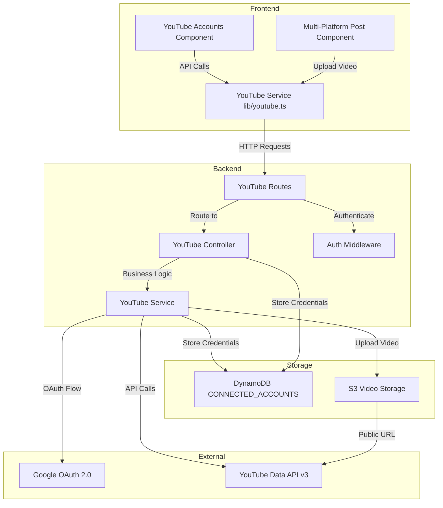
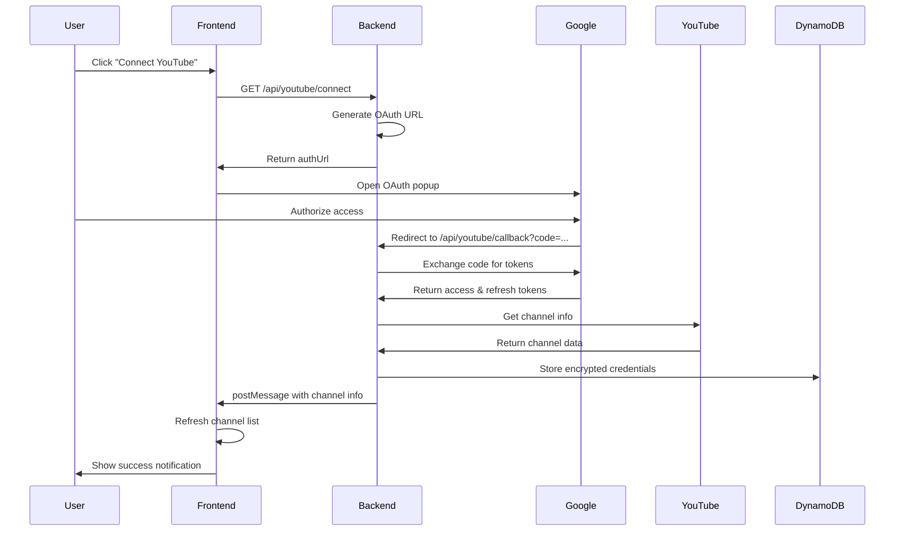
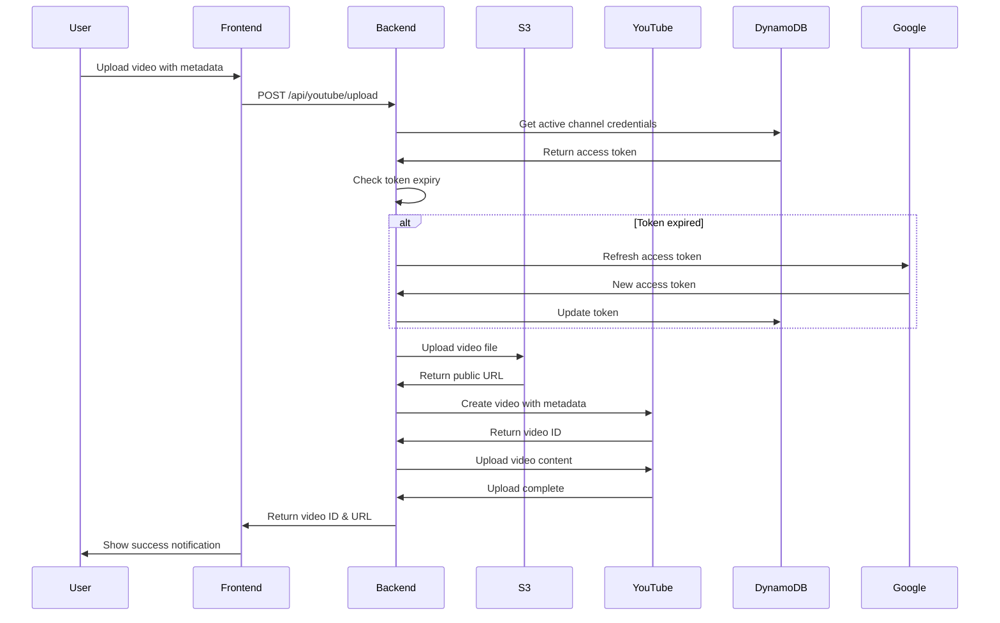

# Design Document: YouTube Content Posting

## Overview

This design document outlines the implementation of YouTube content posting functionality for the SocialOS platform. The feature enables users to connect YouTube channels via Google OAuth 2.0, manage multiple channel connections, upload videos with metadata, and integrate YouTube into the multi-platform posting workflow.

The implementation follows the established Instagram integration pattern, using a three-tier architecture:
- **Backend Controller Layer**: Handles HTTP requests and orchestrates business logic
- **Backend Service Layer**: Manages YouTube Data API v3 interactions and OAuth flows
- **Frontend Component Layer**: Provides UI for channel management and integrates with posting workflows

Key design principles:
- Mirror the Instagram implementation structure for consistency
- Use Google OAuth 2.0 with YouTube Data API v3 scopes
- Store encrypted credentials in DynamoDB CONNECTED_ACCOUNTS table
- Support multiple channels per user with single active channel selection
- Enable parallel multi-platform posting including YouTube
- Provide comprehensive error handling and user feedback

## Architecture

### System Components



### OAuth Flow Sequence



### Video Upload Flow



## Components and Interfaces

### Backend Components

#### 1. YouTube Controller (`youtube.controller.ts`)

The controller handles HTTP requests for YouTube operations, following the same pattern as `instagram.controller.ts`.

**Methods:**

```typescript
class YouTubeController {
  // Initiates OAuth connection flow
  async initiateConnection(req: AuthRequest, res: Response): Promise<void>
  
  // Handles OAuth callback and token exchange
  async handleCallback(req: AuthRequest, res: Response): Promise<void>
  
  // Retrieves all connected YouTube channels for user
  async getConnectedAccounts(req: AuthRequest, res: Response): Promise<void>
  
  // Disconnects a specific YouTube channel
  async disconnectAccount(req: AuthRequest, res: Response): Promise<void>
  
  // Sets a channel as the active channel
  async setActiveAccount(req: AuthRequest, res: Response): Promise<void>
  
  // Uploads a video to the active YouTube channel
  async uploadVideo(req: AuthRequest, res: Response): Promise<void>
}
```

**Implementation Details:**

- `initiateConnection`: Generates OAuth URL with scopes: `youtube.upload`, `youtube.readonly`, `youtube.force-ssl`
- `handleCallback`: Exchanges authorization code for tokens, retrieves channel info, stores in DynamoDB
- `getConnectedAccounts`: Queries DynamoDB by userId and platform='youtube', sanitizes tokens from response
- `disconnectAccount`: Deletes record from DynamoDB, handles active channel reassignment
- `setActiveAccount`: Updates isActive flag for all user's YouTube channels
- `uploadVideo`: Validates metadata, uploads to S3, calls YouTube Service, records in post history

#### 2. YouTube Service (`youtube.service.ts`)

The service layer handles YouTube Data API v3 interactions and OAuth token management.

**Methods:**

```typescript
class YouTubeService {
  // Exchanges authorization code for access and refresh tokens
  async exchangeCodeForTokens(code: string, redirectUri: string): Promise<TokenResponse>
  
  // Refreshes an expired access token using refresh token
  async refreshAccessToken(refreshToken: string): Promise<TokenResponse>
  
  // Retrieves channel information for authenticated user
  async getChannelInfo(accessToken: string): Promise<ChannelInfo>
  
  // Uploads a video with metadata to YouTube
  async uploadVideo(
    accessToken: string,
    videoUrl: string,
    metadata: VideoMetadata
  ): Promise<VideoUploadResponse>
  
  // Retrieves channel statistics (subscribers, views, video count)
  async getChannelStatistics(accessToken: string, channelId: string): Promise<ChannelStatistics>
  
  // Validates video metadata before upload
  validateVideoMetadata(metadata: VideoMetadata): ValidationResult
}
```

**Implementation Details:**

- Uses Google OAuth 2.0 endpoints: `https://oauth2.googleapis.com/token`
- Uses YouTube Data API v3 base URL: `https://www.googleapis.com/youtube/v3`
- Implements resumable upload protocol for videos larger than 5MB
- Validates metadata constraints: title (1-100 chars), description (max 5000 chars), tags (max 500 chars total)
- Handles API quota errors and rate limiting
- Implements exponential backoff for retryable errors

#### 3. YouTube Routes (`youtube.routes.ts`)

Defines RESTful API endpoints for YouTube operations.

```typescript
const router = Router();

router.get('/youtube/connect', authenticateToken, youtubeController.initiateConnection);
router.get('/youtube/callback', youtubeController.handleCallback);
router.get('/youtube/accounts', authenticateToken, youtubeController.getConnectedAccounts);
router.delete('/youtube/accounts/:accountId', authenticateToken, youtubeController.disconnectAccount);
router.put('/youtube/accounts/:accountId/activate', authenticateToken, youtubeController.setActiveAccount);
router.post('/youtube/upload', authenticateToken, youtubeController.uploadVideo);

export default router;
```

**Route Details:**

- All routes except `/callback` require JWT authentication via `authenticateToken` middleware
- `/callback` route is public to allow OAuth redirect from Google
- Routes follow RESTful conventions matching Instagram implementation
- Upload route uses multipart/form-data for video file handling

### Frontend Components

#### 1. YouTube Accounts Component (`youtube-accounts.tsx`)

React component for managing YouTube channel connections in the settings dashboard.

**Component Structure:**

```typescript
export function YouTubeAccounts() {
  const [accounts, setAccounts] = useState<YouTubeAccount[]>([])
  const [loading, setLoading] = useState(true)
  const [disconnectingId, setDisconnectingId] = useState<string | null>(null)
  const { toast } = useToast()
  
  // Load connected accounts on mount
  useEffect(() => {
    loadAccounts()
    // Listen for OAuth completion postMessage
    window.addEventListener('message', handleMessage)
    return () => window.removeEventListener('message', handleMessage)
  }, [])
  
  // Handlers
  const loadAccounts = async () => { /* ... */ }
  const handleConnect = async () => { /* ... */ }
  const handleDisconnect = async (accountId: string) => { /* ... */ }
  const handleSetActive = async (accountId: string) => { /* ... */ }
  
  // Render UI with Card, Avatar, Badge, AlertDialog components
}
```

**UI Features:**

- Displays channel thumbnail, title, subscriber count, and active status
- "Connect Account" button opens OAuth popup
- "Set Active" button for non-active channels
- "Disconnect" button with confirmation dialog
- Empty state when no channels connected
- Loading state during API calls
- Toast notifications for success/error feedback

#### 2. YouTube Service (`lib/youtube.ts`)

Frontend service layer for YouTube API interactions.

```typescript
export interface YouTubeAccount {
  id: string
  platformAccountId: string
  platformUsername: string
  channelTitle: string
  thumbnailUrl?: string
  subscriberCount?: number
  videoCount?: number
  viewCount?: number
  isActive: boolean
  createdAt: string
}

export const youtubeService = {
  async connectAccount(): Promise<void>
  async getConnectedAccounts(): Promise<YouTubeAccount[]>
  async disconnectAccount(accountId: string): Promise<void>
  async setActiveAccount(accountId: string): Promise<void>
  async uploadVideo(
    videoFile: File,
    metadata: VideoMetadata
  ): Promise<VideoUploadResponse>
}
```

**Implementation Details:**

- Uses `NEXT_PUBLIC_API_URL` environment variable for API base URL
- Includes JWT token from localStorage in all requests
- Opens OAuth flow in centered popup window (600x700)
- Throws descriptive errors for error handling in components
- Handles multipart/form-data for video uploads

## Data Models

### ConnectedAccount (Extended for YouTube)

The existing `ConnectedAccount` type is extended to support YouTube-specific fields:

```typescript
export interface ConnectedAccount {
  id: string                          // UUID
  userId: string                      // User ID from Supabase
  platform: PlatformType              // 'youtube'
  platformAccountId: string           // YouTube channel ID
  platformUsername: string            // YouTube channel handle (e.g., @channelname)
  accessToken: string                 // Encrypted OAuth access token
  refreshToken?: string               // Encrypted OAuth refresh token
  tokenExpiry?: string                // ISO timestamp for token expiration
  profilePicture?: string             // Channel thumbnail URL
  isActive: boolean                   // Whether this is the active channel
  
  // YouTube-specific fields in metadata
  metadata?: {
    channelTitle: string              // Full channel title
    subscriberCount?: number          // Subscriber count
    videoCount?: number               // Total videos published
    viewCount?: number                // Total channel views
    customUrl?: string                // Custom channel URL
    description?: string              // Channel description
  }
  
  createdAt: string                   // ISO timestamp
  updatedAt: string                   // ISO timestamp
}
```

### PlatformType (Extended)

```typescript
export type PlatformType = 'instagram' | 'linkedin' | 'twitter' | 'youtube';
```

### YouTubeVideo

New type for video upload operations:

```typescript
export interface YouTubeVideo {
  id: string                          // YouTube video ID
  title: string                       // Video title (1-100 chars)
  description: string                 // Video description (max 5000 chars)
  tags: string[]                      // Video tags (max 500 chars total)
  privacyStatus: 'public' | 'unlisted' | 'private'
  thumbnailUrl?: string               // Video thumbnail URL
  videoUrl: string                    // YouTube video URL
  publishedAt: string                 // ISO timestamp
  viewCount?: number                  // View count
  likeCount?: number                  // Like count
  commentCount?: number               // Comment count
}
```

### VideoMetadata

Type for video upload request:

```typescript
export interface VideoMetadata {
  title: string                       // Required, 1-100 chars
  description: string                 // Required, max 5000 chars
  tags: string[]                      // Optional, max 500 chars total
  privacyStatus: 'public' | 'unlisted' | 'private'  // Required
  categoryId?: string                 // Optional YouTube category
  defaultLanguage?: string            // Optional, e.g., 'en'
  defaultAudioLanguage?: string       // Optional, e.g., 'en'
}
```

### TokenResponse

Type for OAuth token exchange:

```typescript
export interface TokenResponse {
  access_token: string
  refresh_token?: string
  expires_in: number                  // Seconds until expiration
  token_type: string                  // 'Bearer'
  scope: string                       // Granted scopes
}
```

### ChannelInfo

Type for YouTube channel information:

```typescript
export interface ChannelInfo {
  id: string                          // Channel ID
  title: string                       // Channel title
  customUrl?: string                  // Custom URL (e.g., @channelname)
  description: string                 // Channel description
  thumbnailUrl: string                // Channel thumbnail
  subscriberCount: number             // Subscriber count
  videoCount: number                  // Total videos
  viewCount: number                   // Total views
}
```

### VideoUploadResponse

Type for video upload result:

```typescript
export interface VideoUploadResponse {
  videoId: string                     // YouTube video ID
  videoUrl: string                    // Full YouTube URL
  status: 'uploaded' | 'processing' | 'failed'
  thumbnailUrl?: string               // Video thumbnail
}
```

### DynamoDB Schema

The CONNECTED_ACCOUNTS table uses the following structure for YouTube:

**Primary Key:**
- `id` (String) - Partition key, UUID

**Global Secondary Indexes:**
- `UserPlatformIndex`: Composite key of `userId` (partition) and `platform` (sort)

**Attributes:**
- All fields from ConnectedAccount interface
- Tokens stored encrypted using AWS KMS or application-level encryption
- `metadata` stored as JSON string

**Query Patterns:**
1. Get all YouTube channels for user: Query UserPlatformIndex where userId=X and platform='youtube'
2. Get specific channel: Get by id
3. Update active status: Update by id, set isActive
4. Delete channel: Delete by id

## Error Handling

### Error Categories

#### 1. OAuth Errors

**Scenarios:**
- User denies authorization
- Invalid authorization code
- Expired authorization code
- Missing OAuth credentials in environment

**Handling:**
- Redirect to frontend with error query parameter
- Display user-friendly error message
- Log detailed error for debugging
- Provide "Try Again" action

**Example:**
```typescript
if (!tokenData.access_token) {
  console.error('Failed to exchange code for token:', tokenData.error);
  return res.redirect(`${process.env.FRONTEND_URL}/dashboard?error=youtube_token_failed`);
}
```

#### 2. API Quota Errors

**Scenarios:**
- YouTube API daily quota exceeded
- Rate limit hit

**Handling:**
- Return 429 status code
- Include retry-after header
- Display message: "YouTube API quota exceeded. Please try again later."
- Log quota usage for monitoring

**Example:**
```typescript
if (error.response?.status === 403 && error.response?.data?.error?.errors?.[0]?.reason === 'quotaExceeded') {
  return res.status(429).json({
    success: false,
    error: 'YouTube API quota exceeded. Please try again tomorrow.',
    retryAfter: 86400 // 24 hours
  });
}
```

#### 3. Token Expiry Errors

**Scenarios:**
- Access token expired
- Refresh token invalid or expired

**Handling:**
- Automatically refresh token if refresh token valid
- If refresh fails, mark channel as requiring re-authentication
- Display message: "Please reconnect your YouTube channel"
- Provide reconnect button

**Example:**
```typescript
async function ensureValidToken(account: ConnectedAccount): Promise<string> {
  if (new Date(account.tokenExpiry!) < new Date()) {
    try {
      const newTokens = await youtubeService.refreshAccessToken(account.refreshToken!);
      await dynamoDBService.updateAttributes(
        TABLES.CONNECTED_ACCOUNTS,
        { id: account.id },
        {
          accessToken: encrypt(newTokens.access_token),
          tokenExpiry: new Date(Date.now() + newTokens.expires_in * 1000).toISOString()
        }
      );
      return newTokens.access_token;
    } catch (error) {
      throw new Error('Token refresh failed. Please reconnect your YouTube channel.');
    }
  }
  return decrypt(account.accessToken);
}
```

#### 4. Upload Errors

**Scenarios:**
- Video file too large (>256GB)
- Invalid video format
- Invalid metadata (title too long, etc.)
- Network interruption during upload

**Handling:**
- Validate metadata before upload
- Use resumable upload for large files
- Implement retry logic with exponential backoff
- Display specific validation errors
- Show upload progress

**Example:**
```typescript
function validateVideoMetadata(metadata: VideoMetadata): ValidationResult {
  const errors: string[] = [];
  
  if (!metadata.title || metadata.title.length === 0) {
    errors.push('Title is required');
  }
  if (metadata.title.length > 100) {
    errors.push('Title must be 100 characters or less');
  }
  if (metadata.description.length > 5000) {
    errors.push('Description must be 5000 characters or less');
  }
  const totalTagLength = metadata.tags.join('').length;
  if (totalTagLength > 500) {
    errors.push('Total tag length must be 500 characters or less');
  }
  if (!['public', 'unlisted', 'private'].includes(metadata.privacyStatus)) {
    errors.push('Privacy status must be public, unlisted, or private');
  }
  
  return {
    valid: errors.length === 0,
    errors
  };
}
```

#### 5. Database Errors

**Scenarios:**
- DynamoDB connection failure
- Item not found
- Conditional check failure

**Handling:**
- Retry transient errors
- Return 500 for persistent errors
- Log errors with context
- Display generic error message to user

**Example:**
```typescript
try {
  await dynamoDBService.put(TABLES.CONNECTED_ACCOUNTS, account);
} catch (error) {
  console.error('Failed to save YouTube account:', error);
  return res.status(500).json({
    success: false,
    error: 'Failed to save channel connection. Please try again.'
  });
}
```

### Error Response Format

All API errors follow consistent format:

```typescript
interface ErrorResponse {
  success: false
  error: string                       // User-friendly message
  code?: string                       // Error code for client handling
  details?: any                       // Additional error details (dev mode only)
}
```

### Frontend Error Handling

```typescript
try {
  await youtubeService.uploadVideo(file, metadata);
  toast({
    title: "Video Uploaded",
    description: "Your video has been published to YouTube.",
  });
} catch (error: any) {
  toast({
    title: "Upload Failed",
    description: error.message || "Failed to upload video. Please try again.",
    variant: "destructive",
  });
}
```

## Testing Strategy

### Dual Testing Approach

The testing strategy combines unit tests for specific scenarios and property-based tests for universal correctness properties. This dual approach ensures both concrete bug detection and general correctness verification.

**Unit Tests:**
- Specific examples demonstrating correct behavior
- Edge cases (empty inputs, boundary values, special characters)
- Error conditions (invalid tokens, quota exceeded, network failures)
- Integration points between components

**Property-Based Tests:**
- Universal properties that hold for all inputs
- Comprehensive input coverage through randomization
- Minimum 100 iterations per property test
- Each test tagged with feature name and property number

### Testing Framework

**Backend:**
- Framework: Jest with TypeScript
- Property Testing: fast-check library
- Mocking: jest.mock for external APIs
- Coverage target: 80% code coverage

**Frontend:**
- Framework: Jest + React Testing Library
- Property Testing: fast-check library
- Component testing: User interaction simulation
- Coverage target: 75% code coverage

### Test Organization

```
Backend/src/__tests__/
  youtube.controller.test.ts
  youtube.service.test.ts
  youtube.integration.test.ts
  youtube.properties.test.ts

Frontend/__tests__/
  youtube-accounts.test.tsx
  youtube.service.test.ts
  youtube.properties.test.ts
```

### Property Test Configuration

Each property test must:
- Run minimum 100 iterations
- Include comment tag: `// Feature: youtube-content-posting, Property N: <property text>`
- Reference design document property number
- Use fast-check generators for input randomization

**Example:**
```typescript
// Feature: youtube-content-posting, Property 1: Token refresh preserves channel access
it('should maintain channel access after token refresh', async () => {
  await fc.assert(
    fc.asyncProperty(
      fc.record({
        channelId: fc.string(),
        refreshToken: fc.string(),
        userId: fc.uuid()
      }),
      async (input) => {
        // Property test implementation
      }
    ),
    { numRuns: 100 }
  );
});
```

### Mock Data Strategy

**Backend Mocks:**
- Mock Google OAuth endpoints
- Mock YouTube Data API responses
- Mock DynamoDB operations
- Use realistic test data matching API schemas

**Frontend Mocks:**
- Mock fetch API
- Mock localStorage
- Mock window.open for OAuth popup
- Mock postMessage events

### Integration Testing

**OAuth Flow Integration:**
- Test complete flow from initiation to callback
- Verify token storage in DynamoDB
- Verify channel info retrieval
- Test error scenarios (denied access, invalid code)

**Video Upload Integration:**
- Test file upload to S3
- Test YouTube API video creation
- Test metadata validation
- Test multi-platform posting with YouTube

**Channel Management Integration:**
- Test connect/disconnect flows
- Test active channel switching
- Test multiple channels per user
- Test token refresh during operations


## Correctness Properties

A property is a characteristic or behavior that should hold true across all valid executions of a system—essentially, a formal statement about what the system should do. Properties serve as the bridge between human-readable specifications and machine-verifiable correctness guarantees.

### Property 1: OAuth URL Generation

*For any* authenticated user request, when initiating YouTube connection, the generated OAuth URL should contain the required scopes (youtube.upload, youtube.readonly, youtube.force-ssl) and proper redirect URI.

**Validates: Requirements 1.1, 1.2**

### Property 2: Token Exchange and Storage

*For any* valid authorization code, the system should successfully exchange it for access and refresh tokens, and store them encrypted in the database.

**Validates: Requirements 1.3, 1.4**

### Property 3: Channel Information Retrieval

*For any* successful OAuth callback, the system should retrieve channel information (ID, title, thumbnail) and create a Connected_Account record with platform='youtube'.

**Validates: Requirements 1.5, 1.6**

### Property 4: OAuth Error Handling

*For any* OAuth authorization failure, the system should redirect the user with an appropriate error parameter in the URL.

**Validates: Requirements 1.7, 12.1**

### Property 5: First Channel Active by Default

*For any* user with no existing YouTube channels, when connecting their first channel, the system should set isActive=true for that channel.

**Validates: Requirements 1.8**

### Property 6: Duplicate Channel Detection

*For any* channel connection attempt, the system should query for existing records using the channel ID before creating or updating.

**Validates: Requirements 2.1**

### Property 7: Channel Update vs Create

*For any* channel that is already connected, reconnecting should update the existing record with new tokens rather than creating a duplicate.

**Validates: Requirements 2.2, 2.3**

### Property 8: Token Isolation

*For any* user with multiple connected channels, each channel should have distinct access and refresh tokens stored separately.

**Validates: Requirements 2.4**

### Property 9: Channel Display Information

*For any* connected channel displayed in the UI, the rendered output should contain channel title, thumbnail URL, and active status.

**Validates: Requirements 2.5, 8.2**

### Property 10: Single Active Channel Invariant

*For any* user at any point in time, at most one YouTube channel should have isActive=true.

**Validates: Requirements 2.6**

### Property 11: Active Channel Switching

*For any* channel activation request, the system should set isActive=true for the target channel and isActive=false for all other YouTube channels belonging to that user.

**Validates: Requirements 2.7, 4.1, 4.2**

### Property 12: Channel Disconnection

*For any* channel disconnection request, the system should delete the Connected_Account record and all associated tokens from the database.

**Validates: Requirements 3.1, 3.2, 11.5**

### Property 13: Active Channel Reassignment

*For any* active channel that is disconnected when other channels exist, the system should set one of the remaining channels as active.

**Validates: Requirements 3.3**

### Property 14: Active Channel Persistence

*For any* channel activation, the isActive flag changes should be persisted to the CONNECTED_ACCOUNTS table.

**Validates: Requirements 4.3**

### Property 15: Resumable Upload Protocol Selection

*For any* video file larger than 5MB, the YouTube service should use the resumable upload protocol.

**Validates: Requirements 5.2**

### Property 16: Title Validation

*For any* video metadata, the title should be non-empty and not exceed 100 characters, otherwise validation should fail.

**Validates: Requirements 5.3**

### Property 17: Description Validation

*For any* video metadata, the description should not exceed 5000 characters, otherwise validation should fail.

**Validates: Requirements 5.4**

### Property 18: Tags Validation

*For any* video metadata with tags, the total character count across all tags should not exceed 500 characters, otherwise validation should fail.

**Validates: Requirements 5.5**

### Property 19: Privacy Status Validation

*For any* video metadata, the privacy status should be one of 'public', 'unlisted', or 'private', otherwise validation should fail.

**Validates: Requirements 5.6**

### Property 20: Video Upload Response

*For any* successful video upload, the response should contain both videoId and videoUrl fields.

**Validates: Requirements 5.7**

### Property 21: Upload Error Messages

*For any* failed video upload, the system should return a descriptive error message indicating the failure reason.

**Validates: Requirements 5.8**

### Property 22: Active Channel Credential Retrieval

*For any* multi-platform post including YouTube, the system should retrieve the active YouTube channel's credentials before attempting upload.

**Validates: Requirements 6.1**

### Property 23: Parallel Platform Posting

*For any* multi-platform post, YouTube video upload should execute in parallel with other platform posts without blocking.

**Validates: Requirements 6.2**

### Property 24: Media Type Routing

*For any* multi-platform post including YouTube, the system should send video files to YouTube and appropriate media types to other platforms.

**Validates: Requirements 6.3**

### Property 25: Post History Recording

*For any* completed multi-platform post including YouTube, the post history should contain the YouTube video ID.

**Validates: Requirements 6.4**

### Property 26: Failure Isolation

*For any* multi-platform post where YouTube upload fails, the system should continue posting to other platforms and record the YouTube failure separately.

**Validates: Requirements 6.5**

### Property 27: Multi-Platform Summary

*For any* completed multi-platform post, the response should contain success or failure status for each platform.

**Validates: Requirements 6.6**

### Property 28: Automatic Token Refresh

*For any* expired access token, the YouTube service should automatically use the refresh token to obtain a new access token before making API calls.

**Validates: Requirements 7.1, 7.5**

### Property 29: Token Update Persistence

*For any* successful token refresh, the system should update the Connected_Account record with the new access token and expiry time.

**Validates: Requirements 7.2**

### Property 30: Invalid Refresh Token Handling

*For any* invalid or expired refresh token, the system should return an error indicating re-authentication is required.

**Validates: Requirements 7.3, 7.4, 12.4**

### Property 31: Authentication Header Inclusion

*For any* API call made by the frontend YouTube service, the request should include the JWT authentication token in the Authorization header.

**Validates: Requirements 9.5**

### Property 32: Frontend Error Propagation

*For any* failed API call in the frontend YouTube service, the service should throw an error with a descriptive message.

**Validates: Requirements 9.6**

### Property 33: Route Authentication

*For any* YouTube API route except /callback, unauthenticated requests should be rejected with 401 status.

**Validates: Requirements 10.7**

### Property 34: Token Decryption for Use

*For any* token retrieved from the database for API calls, the system should decrypt it before use.

**Validates: Requirements 11.3**

### Property 35: Response Token Sanitization

*For any* channel data returned to the frontend, the response should exclude accessToken and refreshToken fields.

**Validates: Requirements 11.4**

### Property 36: Validation Error Specificity

*For any* video upload with invalid metadata, the error message should specify which metadata field is invalid.

**Validates: Requirements 12.3**

### Property 37: Success Notification Display

*For any* successful YouTube operation, the system should display a success notification with relevant details.

**Validates: Requirements 12.7**

### Property 38: Analytics Display

*For any* connected channel displayed in the UI, the system should fetch and display subscriber count, video count, and view count when available.

**Validates: Requirements 13.1, 13.2, 13.3**

### Property 39: Analytics Caching

*For any* channel analytics, the data should be cached for 1 hour to minimize API calls, and subsequent requests within that window should use cached data.

**Validates: Requirements 13.6**
